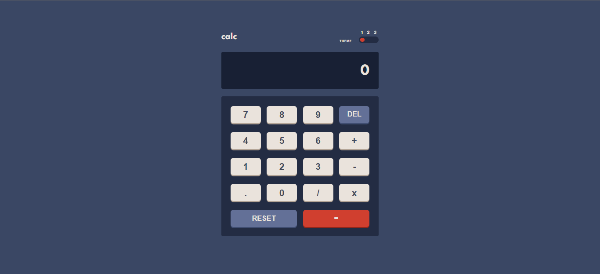

# Exam Term One - Calculator app

#Author Aderline Gashugi
## Overview

### The question

Users should be able to:

- Perform mathematical operations like addition, subtraction, multiplication, and division
- The system should be tested 

### Screenshot

## My process

### Built with

- [React](https://reactjs.org/) - JS library
- [Vite](https://vitejs.dev/) - framework
- [Styled Components](https://styled-components.com/) - Styled Components

### Built with

- To run it type npm start
- To run tests type npx cypress open